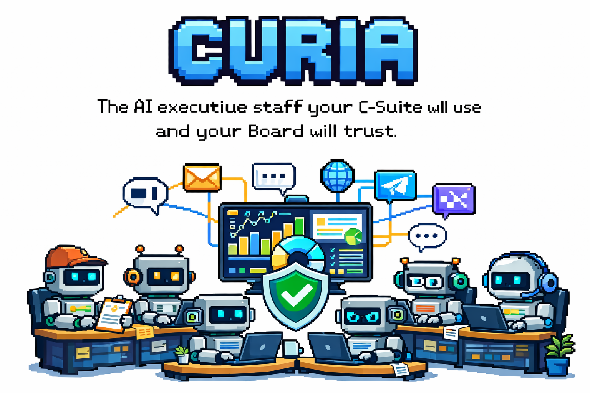
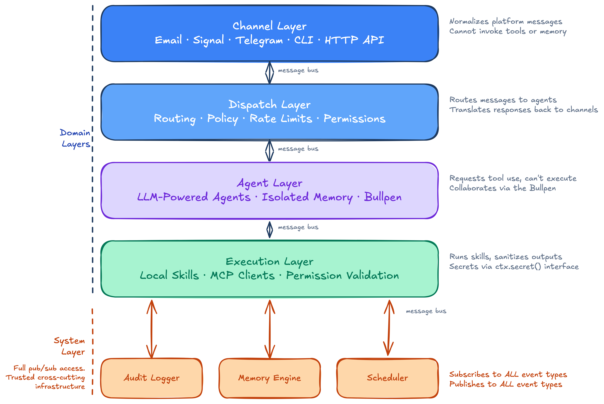

<p align="center">
  
</p>

<p align="center">
  <strong>The AI executive staff your C-Suite will use and your Board will trust.</strong><br/>
  <em>Curia — the Roman administrative court. Where governance happened.</em>
</p>

<p align="center">
  <a href="#quick-start">Quick Start</a> &middot;
  <a href="#architecture">Architecture</a> &middot;
  <a href="#security">Security</a> &middot;
  <a href="docs/specs/00-overview.md">Full Spec</a>
</p>

<p align="center">
  <a href="CHANGELOG.md"></a>
  
  
  = 22" />
  
</p>

---

## The Problem

AI agents are powerful. They're also black boxes with root access.

Most agent frameworks treat security as a configuration option and audit trails as an afterthought. They give agents unrestricted tool access, swallow errors silently, and lose context across restarts. When something goes wrong — and it will — there's no way to trace what happened or why.

That's fine for a demo. It's not fine when the agent is reading your email, tracking your expenses, or acting on your behalf.

**Curia was built for the people who can't afford "it probably won't go rogue."**

---

## What Is Curia?

A multi-agent AI platform designed for executives and their teams. It runs continuously on your own server, handles real workflows across multiple channels, and maintains a sophisticated memory of your world — all with the security posture and audit trail that enterprise governance demands.

Think of it as a digital executive office: specialized agents sit at their desks, collaborate in the bullpen, use shared tools, and report to you. Every action is logged. Every decision is traceable. Every agent stays in its lane.

### What It Actually Does

- **Reads your email** and extracts action items, receipts, and scheduling requests
- **Tracks expenses** from receipts and bank notifications, categorized and summarized
- **Researches topics** across multiple sessions, building on previous findings
- **Manages your calendar** with context about attendees and past interactions
- **Responds on your behalf** across Signal and email — with your voice and your boundaries
- **Remembers everything that matters** — who people are, what was decided, what's still pending — in a knowledge graph that gets smarter over time

### What Makes It Different

| | Typical Agent Framework | Curia |
|---|---|---|
| **Security model** | "Trust the agent" | Hard-enforced layer separation — channel adapters *physically cannot* invoke tools |
| **Audit trail** | Console.log | Append-only Postgres with causal tracing across every event |
| **Memory** | Conversation history (lost on restart) | Knowledge graph + entity memory + temporal awareness (survives restarts, ages gracefully) |
| **Error handling** | Retry and hope | Error budgets, state continuity, pattern detection — agents resume, not restart |
| **Agent communication** | Agents work in isolation | The Bullpen — structured, auditable, threaded inter-agent discussions |
| **Multi-channel** | Single chat interface | Email, Signal, CLI, HTTP API — same agent, any channel |

---

## Architecture

Five layers connected by a message bus — four domain layers with hard security boundaries, plus a System layer for trusted cross-cutting infrastructure. No layer can call another directly. Every event is audited.

<p align="center">
  
</p>

The message bus enforces these boundaries at registration time. A channel adapter registered as `layer: "channel"` that attempts to publish a `skill.invoke` event gets an error — not a warning, not a log entry, an error. The architecture prevents misuse; it doesn't just discourage it.

**[Full architecture spec →](docs/specs/00-overview.md)**

---

## Security

Security isn't a feature of Curia. It's the reason it exists.

### 1. Hard Layer Separation

Every component declares its layer at startup. The bus enforces which event types each layer can publish or subscribe to. A compromised email adapter can spam inbound messages — but it cannot invoke a skill, write to memory, or execute code. The boundary is architectural, not policy.

### 2. Append-Only Audit Trail

Every event that flows through the bus — every message received, every tool invoked, every inter-agent discussion — is written to an append-only audit log in Postgres *before* it's delivered to subscribers. No UPDATE, no DELETE. If the process crashes mid-delivery, the event is still logged.

Every event carries a `parent_event_id`, so you can trace the full causal chain: "This expense was categorized because this email was received, which triggered this agent, which invoked this skill, which returned this result."

### 3. Secrets Never Touch the LLM

Agents don't see passwords, API keys, or tokens. Ever. Skills access secrets through a scoped interface (`ctx.secret()`), validated against the skill's declared manifest. The LLM sees "email-parser connected to inbox" — never the IMAP password. Every secret access is audit-logged.

### 4. Tool Output Sanitization

All skill results are sanitized before being fed back to the LLM: XML/HTML tags stripped, outputs truncated, secret-like patterns redacted. Error messages are wrapped in structured tags to prevent prompt injection. Nothing from the outside world reaches the LLM unfiltered.

### 5. Intent Drift Detection

Long-running tasks store an intent anchor — the original task description. On each execution burst, the system compares current progress against the anchor. If the agent has drifted from its goal, the task is **paused**, not just flagged. In unattended mode, drift detection blocks — it doesn't advise.

### 6. Error Budgets

Every agent task has hard caps: maximum LLM round-trips, maximum dollar spend, maximum consecutive errors. When a budget is exceeded, the task stops. No infinite loops, no surprise bills, no runaway agents.

---

## Memory

Most agent frameworks forget everything between sessions. Curia remembers — and knows what it doesn't know anymore.

### Knowledge Graph

People, organizations, projects, decisions, events — stored as nodes and edges in Postgres with full relationship traversal. Ask "what decisions did we make about Project X that involved Person Y?" and get a real answer, not a hallucination.

### Entity Memory

Configurable facts about the people and things in your world. "The CEO takes their coffee black." "Board meetings are quarterly, first Thursday." Facts carry confidence scores and source attribution — the system knows *why* it believes something and *how recently* that belief was confirmed.

### Temporal Awareness

Not all facts age the same way. "The CEO was born in Toronto" is permanent. "The CEO lives in Kitchener" decays slowly. "The CEO's current project focus" decays fast. Every fact carries a decay class, so stale information loses confidence over time rather than being trusted forever.

### Semantic Search

Entity descriptions and facts are embedded via pgvector, enabling queries like "find everything related to our fundraising strategy" even when the word "fundraising" doesn't appear in any node labels.

### The Bullpen

Agents don't work in isolation. When the expense tracker finds a receipt that might relate to a benefits claim, it opens a thread in the Bullpen — a structured, auditable discussion space where agents coordinate. Every exchange is logged, visible to you, and interruptible. Think of it as overhearing your staff collaborate at their desks.

---

## Agents

Define agents in YAML. No code required for simple agents:

```yaml
name: expense-tracker
description: Tracks and categorizes expenses from receipts and emails

model:
  provider: anthropic
  model: claude-sonnet-4-20250514
  fallback:
    provider: openai
    model: gpt-4o

system_prompt: |
  You are an expense tracking assistant for a CEO.
  Extract amounts, vendors, categories, and dates from receipts.

pinned_skills:
  - email-parser
  - spreadsheet-writer

memory:
  scopes: [expenses, vendors, budgets]

schedule:
  - cron: "0 9 * * 1"
    task: "Generate weekly expense summary"

error_budget:
  max_turns: 20
  max_cost_usd: 1.00
```

Need custom logic? Add a TypeScript handler as an escape hatch — same config, plus hooks for `onTask`, `onSkillResult`, and `beforeRespond`.

Agents discover new skills automatically. A built-in skill registry lets agents find capabilities they weren't explicitly configured with. Sensitive skills (payments, deletions) require your approval on first use — once, not every time.

---

## Skills

Two types, one interface. Agents don't know or care which kind they're using.

**Local skills** — directories with a manifest and handler:
```
skills/email-parser/
  skill.json      # name, inputs, outputs, permissions, sensitivity
  handler.ts      # implementation
  handler.test.ts # tests
```

**MCP skills** — connect to any Model Context Protocol server:
```yaml
mcp_servers:
  - name: github
    transport: sse
    url: https://mcp-server.example.com/sse
```

Skills declare their permissions and required secrets in their manifest. The execution layer validates both before invocation. No skill can access a secret it didn't declare. No skill can exceed its declared permissions.

---

## Channels

Talk to your agents wherever you are:

| Channel | How It Works |
|---|---|
| **Email** | IMAP polling + SMTP. Agents read your inbox, extract action items, reply on your behalf. |
| **Signal** | Via signal-cli. End-to-end encrypted messaging with your agents. |
| **CLI** | Interactive terminal for local development and testing. |
| **HTTP API** | REST + SSE for web dashboards, mobile apps, and programmatic access. |

Every channel is a thin adapter that normalizes messages in and out. Adding a new channel means implementing one interface — no core changes required. All channels share the same security model: they can pass messages, nothing more.

---

## Scheduling

Agents work while you sleep.

**Recurring tasks** via cron:
```yaml
schedule:
  - cron: "0 9 * * 1"
    task: "Generate weekly expense summary"
  - cron: "0 */4 * * *"
    task: "Check inbox for new receipts"
```

**Long-running tasks** execute in bursts. A research task spanning days doesn't hold a process open — it saves progress, sleeps, and the scheduler wakes it up for the next chunk. Full state in Postgres. Survives restarts.

**Dynamic scheduling** — agents can create their own scheduled jobs at runtime. "Remind me every Friday to review the expense report" just works.

## Autonomy Engine

Curia operates at a configurable autonomy level — a single score from 0 to 100 that determines how independently it acts across all channels and skills.

The score maps to one of five **autonomy bands**:

| Band | Score | What it means |
|---|---|---|
| **Full** | 90–100 | Acts independently. Flags only genuinely novel or irreversible actions. |
| **Spot-check** | 80–89 | Proceeds on routine tasks. Notes consequential actions for CEO visibility. |
| **Approval Required** | 70–79 | Presents a plan and asks for confirmation before any consequential action. |
| **Draft Only** | 60–69 | Prepares drafts and plans but does not send or act without explicit instruction. |
| **Restricted** | < 60 | Advisory only. Takes no independent action whatsoever. |

The current band is injected into Curia's system prompt on every task, so its self-governance adjusts immediately when the score changes — no restart required.

**CEO controls (via CLI or email):**
- *"What is your current autonomy score?"* — Curia reports its score, band, and recent change history
- *"Set your autonomy score to 85"* — Curia updates the score and confirms the change

The score defaults to **75 (Approval Required)** on first deployment. Scores are stored in Postgres with a full change history. Future versions will adjust the score automatically based on performance metrics (task success rate, factual correction rate, follow-through).

---

## Multi-Provider LLM Support

| Provider | Models | Use Case |
|---|---|---|
| **Anthropic** | Claude Opus, Sonnet, Haiku | Primary — best for nuanced reasoning and long context |
| **OpenAI** | GPT-4o, o1-pro, GPT-4o-mini | Fallback, cost optimization |
| **Ollama** | Llama, Mistral, Gemma, etc. | Local/private — no data leaves your server |

Each agent specifies its provider and model. Configure fallbacks for resilience — if Anthropic is down, the agent switches to OpenAI automatically. All providers normalize to a common response type. No `any` types, no provider-specific leaks.

---

## Quick Start

> **Note:** Curia is in pre-alpha. The spec is complete; implementation is underway. Star the repo to follow progress.

Getting set up involves connecting a few external services (Postgres, an LLM provider, optionally Nylas for email). The full guide covers prerequisites, configuration tiers, and verification steps:

**[→ Development Setup Guide](docs/dev/setup.md)**


### Web App

Curia includes a built-in web app at `http://localhost:3000`. Current features include a knowledge graph browser for exploring nodes, relationships, and entity memory. More tools will be added here as the platform matures.

The web app requires `WEB_APP_BOOTSTRAP_SECRET` in `.env` — set this to any long random string before starting. See the [setup guide](docs/dev/setup.md) for details.

---

## Project Status & Documentation

| Spec | Area | Status |
|---|---|---|
| [00](docs/specs/00-overview.md) | Architecture & message bus | ✅ Implemented |
| [01](docs/specs/01-memory-system.md) | Memory system (working memory + knowledge graph) | Partial — core implemented; Bullpen, context management, decay engine planned |
| [02](docs/specs/02-agent-system.md) | Agent system (config, delegation, registry) | ✅ Implemented |
| [03](docs/specs/03-skills-and-execution.md) | Skills & execution layer | Partial — local skills implemented; MCP discovery planned |
| [04](docs/specs/04-channels.md) | Channels (CLI, HTTP, Email) | Partial — CLI, HTTP, Email done; Signal planned |
| [05](docs/specs/05-error-recovery.md) | Error recovery (budgets, patterns, continuity) | ✅ Implemented |
| [06](docs/specs/06-audit-and-security.md) | Audit & security | Partial — basic audit logging in place; redaction & hardening planned |
| [07](docs/specs/07-scheduler.md) | Scheduler (cron, one-shot, persistent tasks) | ✅ Implemented |
| [08](docs/specs/08-operations.md) | Operations (deployment, health, monitoring) | Planned |
| [09](docs/specs/09-contacts-and-identity.md) | Contacts & identity (auth, unknown sender policy) | ✅ Implemented |
| [10](docs/specs/10-audit-log-hardening.md) | Audit log hardening (hash-chain, HITL, provenance) | Planned |
| [11](docs/specs/11-entity-context-enrichment.md) | Entity context enrichment (KG-backed sender/entity profiles) | Planned — spec drafted |
| [12](docs/specs/12-knowledge-graph-web-explorer.md) | Knowledge graph web explorer | ✅ Implemented |
| [13](docs/specs/13-office-identity.md) | Office identity (persona, voice, runtime config) |  ✅ Implemented |
| [14](docs/specs/14-autonomy-engine.md) | Autonomy engine (global score, CEO controls, per-task prompt injection) | Partial: core implemented; self-monitoring & tuning planned |
| [15](docs/specs/15-outbound-safety.md) | Outbound safety (content filter, gateway, display name sanitization, caller verification) | Partial — deterministic rules done; LLM-as-judge planned |
| [16](docs/specs/16-smoke-test-framework.md) | Smoke test framework (chat-based cases, LLM-as-judge, HTML reports) | ✅ Implemented |
| — | Web dashboard | Partial |
| — | Additional channels: Voice, Slack, Telegram | Future |

---

## Contributing

Curia is in early development and welcomes contributions — including AI-assisted ones.

- Read the **[Contributing Guide](CONTRIBUTING.md)** for dev setup, code standards, and how to add channels/skills/agents
- Read **[CLAUDE.md](CLAUDE.md)** for repo-level conventions (if you're using Claude Code, these load automatically)
- Check **[open issues](https://github.com/josephfung/curia/issues)** — look for `good first issue` labels
- Report security vulnerabilities via **[SECURITY.md](SECURITY.md)** — not public issues

We evaluate code quality, not authorship. AI-generated contributions are held to the same review standards as human-written code. See the [AI contributions policy](CONTRIBUTING.md#ai-assisted-contributions) for details.

---

## License

[MIT](LICENSE)

---

<p align="center">
  <strong>Auditable. Secure. Memory that lasts.</strong><br/>
  <em>The executive AI platform built for the people who sign the checks.</em>
</p>
