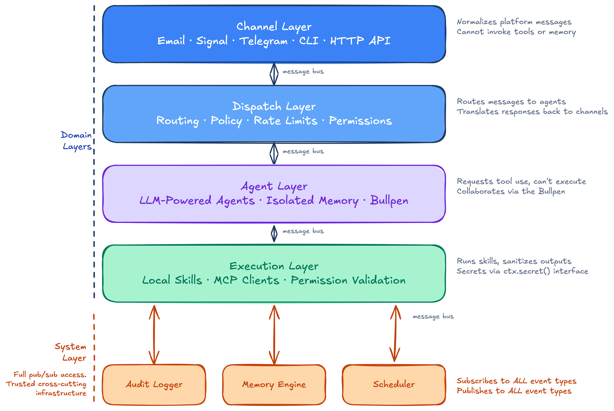

<p align="center">
  
</p>

<p align="center">
  <strong>An open-source Digital Office of the CEO — communications, scheduling, research, and knowledge work with governance-first architecture.</strong>
</p>

<p align="center">
  <a href="CHANGELOG.md"></a>
  
  
  = 22" />
  
</p>

<p align="center">
  <a href="https://meetcuria.com">Website</a> &middot;
  <a href="https://docs.meetcuria.com">Documentation</a> &middot;
  <a href="CONTRIBUTING.md">Contributing</a> &middot;
  <a href="SECURITY.md">Security</a>
</p>

---

## What Is Curia?

CEOs of knowledge-work companies are buried in digital operations — email, scheduling, research, information processing. The traditional answer is an executive assistant, but the cycle is brutal: hire, invest six months training, watch the institutional knowledge walk out the door when they leave.

Curia is a coordinator and team of specialist agents that handle your communications, scheduling, research, and knowledge work — running continuously on your own server, with institutional memory that compounds over time and never walks out the door. Define agents in YAML, extend with custom skills, connect any channel.

Every action is logged. Every decision is traceable. Every agent stays in its lane.

| | Typical Agent Framework | Curia |
|---|---|---|
| **Security model** | "Trust the agent" | Hard-enforced layer separation — channel adapters *physically cannot* invoke tools |
| **Self-modification** | Agents can edit their own prompts, tools, and code at runtime | Agents cannot modify themselves — new skills, agents, and prompts always require human approval |
| **Audit trail** | Console.log | Append-only Postgres with causal tracing across every event |
| **Institutional memory** | Conversation history + flat files (lost or stale across restarts) | Knowledge graph + entity memory + temporal decay (survives restarts, ages gracefully) |
| **Error handling** | Retry and hope | Error budgets, state continuity, pattern detection — agents resume, not restart |
| **Agent coordination** | Agents work in isolation | The Bullpen — structured, auditable, threaded inter-agent discussions |
| **Multi-channel** | Many channels, often without consistent security boundaries | Email, Signal, CLI, HTTP API — every channel shares the same security model and audit trail |
| **Autonomy** | All or nothing | Five configurable bands — from advisory-only to fully independent, with intent drift detection |

---

## Architecture

Five layers connected by a message bus — four domain layers with hard security boundaries, plus a System layer for trusted cross-cutting infrastructure. No layer can call another directly. Every event is audited.

<p align="center">
  
</p>

**[Full architecture guide →](https://docs.meetcuria.com/core-concepts/architecture)**

---

## What It Looks Like

Agents are defined in YAML. No code required for simple agents:

```yaml
name: expense-tracker
description: Tracks and categorizes expenses from receipts and emails

system_prompt: |
  You are an expense tracking assistant for a CEO.
  Extract amounts, vendors, categories, and dates from receipts.

pinned_skills:
  - email-parser
  - spreadsheet-writer

memory:
  scopes: [expenses, vendors, budgets]

schedule:
  - cron: "0 9 * * 1"
    task: "Generate weekly expense summary"

error_budget:
  max_turns: 20
  max_cost_usd: 1.00
```

Need custom logic? Add a TypeScript handler — same config, plus hooks for `onTask`, `onSkillResult`, and `beforeRespond`.

Skills come in two flavours (local handlers and MCP servers) behind a single interface. Agents discover new skills automatically; sensitive skills require your approval on first use.

**[Agents →](https://docs.meetcuria.com/agents/how-agents-work)** &middot; **[Skills →](https://docs.meetcuria.com/skills/how-skills-work)** &middot; **[Channels →](https://docs.meetcuria.com/channels/how-channels-work)** &middot; **[Security →](https://docs.meetcuria.com/security/overview)**

---

## Quick Start

> **Note:** Curia is in pre-alpha. The spec is complete; implementation is underway. Star the repo to follow progress.

**Prerequisites:** Node >= 22, PostgreSQL 16+ with pgvector, an LLM provider API key (Anthropic, OpenAI, or Ollama).

```bash
git clone https://github.com/josephfung/curia.git
cd curia
cp .env.example .env        # add your API keys and DB connection
npm install
npm run db:migrate
npm start
```

The full setup guide covers configuration tiers, channel setup, Docker Compose, and verification steps:

**[→ Full installation guide](https://docs.meetcuria.com/get-started/installation)**

---

## Contributing

Curia is in early development and welcomes contributions — including AI-assisted ones.

- Read the **[Contributing Guide](CONTRIBUTING.md)** for dev setup, code standards, and how to add channels, skills, and agents
- Read **[CLAUDE.md](CLAUDE.md)** for repo-level conventions (if you're using Claude Code, these load automatically)
- Check **[open issues](https://github.com/josephfung/curia/issues)** — look for `good first issue` labels
- Report security vulnerabilities via **[SECURITY.md](SECURITY.md)** — not public issues

We evaluate code quality, not authorship. AI-generated contributions are held to the same review standards as human-written code. See the [AI contributions policy](CONTRIBUTING.md#ai-assisted-contributions) for details.

---

## License

[MIT](LICENSE)
