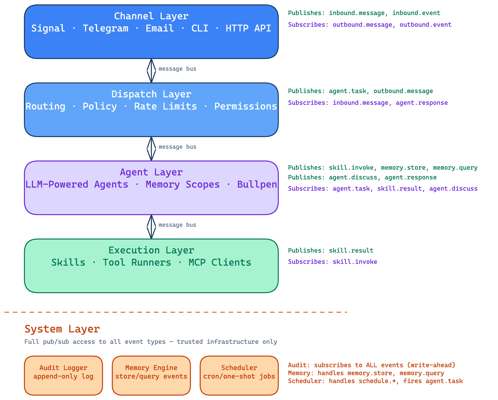

# Curia Framework — Architecture Overview

**Date:** 2026-03-24
**Status:** Approved

## Spec Index

| # | Document | Scope | Status |
|---|----------|-------|--------|
| 00 | This file | Architecture, layers, bus, message flow, design principles | ✅ Implemented |
| 01 | [Memory System](01-memory-system.md) | Knowledge graph, entity memory, working memory, Bullpen, embeddings | Partial — core and Bullpen implemented; context management, decay engine planned |
| 02 | [Agent System](02-agent-system.md) | Agent definition, lifecycle, state, execution modes, LLM providers | ✅ Implemented |
| 03 | [Skills & Execution](03-skills-and-execution.md) | Local skills, MCP, discovery, secrets, permissions | Partial — local skills implemented; MCP discovery planned |
| 04 | [Channels](04-channels.md) | Adapter interface, CLI, HTTP, Signal, Email channels, message normalization | ✅ Implemented |
| 05 | [Error Recovery](05-error-recovery.md) | Error budgets, state continuity, pattern detection, failure model | ✅ Implemented |
| 06 | [Audit & Security](06-audit-and-security.md) | Audit log, redaction, tool sanitization, intent drift, security | Partial — basic audit logging in place; redaction & hardening planned |
| 07 | [Scheduler](07-scheduler.md) | Job model, cron, one-shot, persistent tasks, burst execution | ✅ Implemented |
| 08 | [Operations](08-operations.md) | Config, deployment, health checks, logging, project structure | Planned |
| 09 | [Contacts & Identity](09-contacts-and-identity.md) | Contact resolution, identity verification, unknown sender policy, authorization, channel identity linking | ✅ Implemented |
| 10 | [Audit Log Hardening](10-audit-log-hardening.md) | Structured audit fields, LLM provenance, tamper evidence, source attribution, HITL records | Planned |
| 11 | [Entity Context Enrichment](11-entity-context-enrichment.md) | Entity model, KG-backed sender/entity profiles, context assembly, agent self-identity, skill convention for entity-scoped operations | Partial - Phase 1 done, Phase 2 and 3 pending  |
| 12 | [Knowledge Graph Web Explorer](12-knowledge-graph-web-explorer.md) | Knowledge graph browser, relationship visualization, entity memory viewer | ✅ Implemented |
| 13 | [Office Identity](13-office-identity.md) | Persona config, voice settings, runtime identity injection | ✅ Implemented |
| 14 | [Autonomy Engine](14-autonomy-engine.md) | Global score, autonomy bands, skill action_risk, per-task prompt injection, CEO controls | Partial — core implemented; self-monitoring & tuning planned |
| 15 | [Outbound Safety](15-outbound-safety.md) | Content filter, display name sanitization, caller verification, LLM-as-judge gateway | Partial — deterministic rules done; LLM-as-judge planned |
| 16 | [Smoke Test Framework](16-smoke-test-framework.md) | Chat-based test cases, LLM-as-judge evaluation, HTML reports | ✅ Implemented |

---

## Context

After auditing four open-source agent frameworks (agentsystems, Daemora, ForgeAI, Edict), all were found to be high-risk for production use — single-maintainer projects with no code review, thin tests, and immature architectures. The decision is to build a minimal custom framework ("Curia") purpose-built for a long-running, VPS-hosted executive assistant system.

The framework replaces the existing Zora dependency entirely (clean break). It lives in the `curia` repo (currently an empty scaffold) and deploys via the existing `ceo-deploy` infrastructure (Hetzner VPS, Docker Compose, Caddy).

**Zora migration:** No data migration. Zora's audit logs, policies, and dashboard state are discarded. The existing Zora container in `ceo-deploy` will be replaced with the new framework container. This is a conscious decision — Zora was an evaluation, not a production system with accumulated data worth preserving.

---

## Design Principles

1. **Hard security boundaries** — layers are physically prevented from unauthorized actions, not just organizationally separated
2. **Everything is auditable** — every event, decision, and inter-agent exchange is logged and traceable
3. **Memory-first** — sophisticated knowledge graph with temporal awareness, not just conversation logs
4. **Extensible by design** — new channels, skills, and agents added without touching core code
5. **Restart-safe** — all state lives in Postgres, no in-process state that dies with the process
6. **Single-tenant simplicity** — no multi-tenant complexity; deploy multiple VPS instances for multiple users
7. **Errors are recoverable** — agents resume with full context, not from scratch; failures are learning opportunities
8. **Observable by default** — structured logging, health endpoints, and audit trails from day one, not bolted on later

---

## Architecture: Message Bus Pattern

All communication flows through a central in-process message bus backed by Postgres for persistence. There are five layers: four domain layers (Channel, Dispatch, Agent, Execution) with hard security boundaries, plus a System layer for trusted cross-cutting infrastructure. Each layer is a separate module that subscribes to and publishes typed messages. The bus enforces which event types each layer can publish.

### Bus Security Enforcement

The bus validates publisher authorization at registration time. A module registered as `layer: "channel"` can only publish event types in the channel allowlist (`inbound.message`, `inbound.event`). Attempting to publish `skill.invoke` throws an error. This is the hard security boundary — it's architectural, not policy.

The exception is the **System layer**, which has full publish and subscribe access to all event types. This is reserved for trusted infrastructure components (audit logger, memory engine, scheduler) that need cross-cutting access to operate.

### Event Routing (complete message flow)

Full round-trip for an inbound message:
1. Channel adapter publishes `inbound.message`
2. Dispatch layer (subscribed to `inbound.message`) evaluates policy, publishes `agent.task`
3. Agent (subscribed to `agent.task`) calls LLM, may publish `skill.invoke`
4. Execution layer (subscribed to `skill.invoke`) runs skill, publishes `skill.result`
5. Agent (subscribed to `skill.result`) incorporates result, publishes `agent.response`
6. Dispatch layer (subscribed to `agent.response`) translates to `outbound.message`
7. Channel adapter (subscribed to `outbound.message`) sends via platform API

Bullpen flow: Agent publishes `agent.discuss` → target agent (subscribed to `agent.discuss`) responds in the same thread.

### Bus Delivery Guarantees

**Write-ahead audit logging.** The audit logger writes events to Postgres *before* delivering to other subscribers. If the process crashes after audit write but before subscriber delivery, the event is logged but unprocessed — on restart, the system can replay unacknowledged events from the audit log. This gives at-least-once delivery for all events and exactly-once audit recording.

For launch, the replay mechanism is manual (operator can query unprocessed events). Automatic replay on startup is a future enhancement.

### Event Type Registry

All event types are defined as a TypeScript discriminated union — no `any` payloads, no string-typed event names without compile-time checking. Each event carries: `id` (UUID), `timestamp`, `type` (discriminant), `source_layer`, `source_id`, `parent_event_id?`, and a typed `payload`.

---

## Tech Stack

- **Runtime:** Node.js 22+ with TypeScript (ESM)
- **Database:** PostgreSQL 16+ with pgvector extension
- **LLM SDKs:** @anthropic-ai/sdk, openai, ollama
- **MCP:** @modelcontextprotocol/sdk (client)
- **HTTP:** Fastify (for HTTP API channel + dashboard endpoints)
- **Testing:** Vitest
- **Build:** tsup
- **Config:** YAML (js-yaml) with env var interpolation
- **Logging:** pino (structured JSON)
- **Migrations:** node-pg-migrate (plain SQL migrations, no ORM coupling)
- **Embeddings:** OpenAI `text-embedding-3-small` (1536 dimensions), pgvector HNSW index

---

## What Is NOT In Scope (Launch)

- Multi-tenancy
- Web dashboard UI (HTTP API is ready for it, but no frontend yet)
- Memory decay engine (schema supports it, logic deferred)
- Voice/telephony channel
- Secrets vault (env vars behind ctx.secret() interface for now)
- Skill marketplace or versioning
- Automatic event replay on startup (manual query for now)
